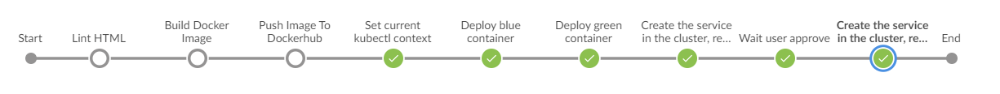

# Kubernetes Jenkins

This project consists of building docker images and creating kubernetes cluster and nodes using Amazon EKS which creates the control pane and using eksctl to create pods. 

Docker Image is also stored in Docker hub repository and future improvements will include using Amazon's container repository and code pipeline to orchestrate CICD full on AWS.

## Project Requirements

This project requires installing AWS EC2 instance preferably t3.medium with 40 GB Space and installation of Java JDK, Jenkins, Docker, AWS CLI version 2, EKSCTL, Kubectl and finally credentials plugin on Jenkins. 

## Project Showcase
* AWS
* Docker
* Jenkins
* CloudFormation
* EKS
* Multi Branch Pipelines

The project contains 2 pipelines, the first one is to create the cluster on AWS using eksctl 

The Second pipeline will deploy the project after building docker image and linting html after which blue green deployment strategy is utilised.

